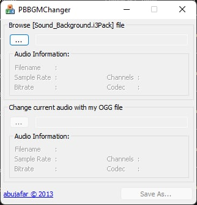
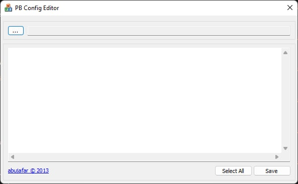
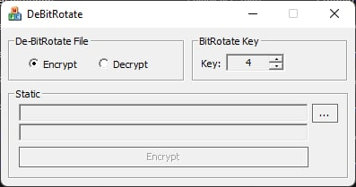
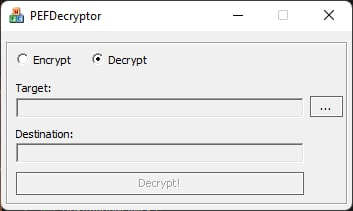

# Point Blank Modification Tools

### I3PackTool
A tool to open and extract `.i3pack` files.
 

### I3ITool
A tool to convert `*.i3i` file you've got from extracted `*.i3pack` file to [**DirectDraw Surface**](https://en.wikipedia.org/wiki/DirectDraw_Surface) (`*.dds` file).

### DDSPatcher / DDSToI3I
A tool to convert `*.dds` to `*.i3i` format.

### BGMChanger
A tool to change default background sound using `*.ogg` format.

### ConfigEditor
A tool to edit encrypted config content (e.g. `lwsi_En.sif`)

### DeBitRotate
A tool just like **ConfigEditor**, but you can adjust shift key to find the correct shift key.

### PEFDecryptor
A tool to decrypt `*.pef` file.

### How to compile
-------------------

+  You gonna need Visual Studio 2015 or Up.
+  Open the project.
+  Go to Project > Manage NuGet Packages
+  Search for boost.
+  Install the last version and restart the VS.
